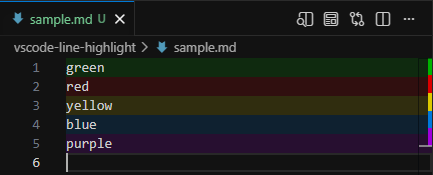

# vscode-line-highlight

<div align="center">

[](https://github.com/nnyj/vscode-line-highlight/stargazers)
[](https://github.com/nnyj/vscode-line-highlight/releases)
[](https://github.com/nnyj/vscode-line-highlight/releases/latest)
[](https://github.com/nnyj/vscode-line-highlight/actions)

</div>

VS Code extension that highlights editor lines from plain JSON files in `.vscode/highlights/`, making highlights version-controllable and writable by scripts and AI assistants.



## Features

- Five named colors: green, red, yellow, blue, purple
- File-based: highlights stored in `.vscode/highlights/`, not in VS Code state
- Line positions shift automatically during in-editor edits; written back on save
- External edits (outside VS Code) are not tracked, line numbers are trusted as-is
- Context menu submenu for per-color toggle and remove
- Command palette toggle with color picker
- Overview ruler marks; optional gutter bar
- All background colors configurable
- Multi-root workspace support

## Usage

Right-click any line → "Line Highlight" → pick color. Same color again removes it.

Command palette: "Line Highlight: Toggle Highlight on Line" (color picker), "Line Highlight: Clear All Highlights".

### Programmatic

Any tool can write the JSON file; the extension reloads via file watcher:

```sh
echo '[{"line": 42, "color": "red"}]' > .vscode/highlights/src__app.py.json
```

Filename uses `__` as path separator (`src/app.py` → `src__app.py.json`).

```json
[
  {"line": 12, "color": "red", "note": "optional hover tooltip"},
  {"line": "3-7", "color": "green"}
]
```

Add to `CLAUDE.md` / `AGENTS.md` for AI assistant support:

```
Line highlights:
- Write `.vscode/highlights/<path__to__file.ext>.json`
- Format: `[{"line": 1, "color": "green", "note": "optional"}]`
- Colors: green, red, yellow, blue, purple
- Ranges: `"line": "3-7"`, `__` = path separator
```

## Settings

| Setting | Default | Description |
|---------|---------|-------------|
| `lineHighlight.gutterBar.enabled` | `false` | Show colored left-edge gutter bar |
| `lineHighlight.overviewRuler.position` | `"right"` | Ruler: `left`, `center`, `right`, `full`, `off` |
| `lineHighlight.colors.green` | `rgba(0,180,0,0.15)` | Green background |
| `lineHighlight.colors.red` | `rgba(220,0,0,0.15)` | Red background |
| `lineHighlight.colors.yellow` | `rgba(220,200,0,0.15)` | Yellow background |
| `lineHighlight.colors.blue` | `rgba(0,120,220,0.15)` | Blue background |
| `lineHighlight.colors.purple` | `rgba(160,0,220,0.15)` | Purple background |

## Install

```sh
npm run package
code --install-extension line-highlight-0.0.2.vsix
```

## License

[MIT](LICENSE)
